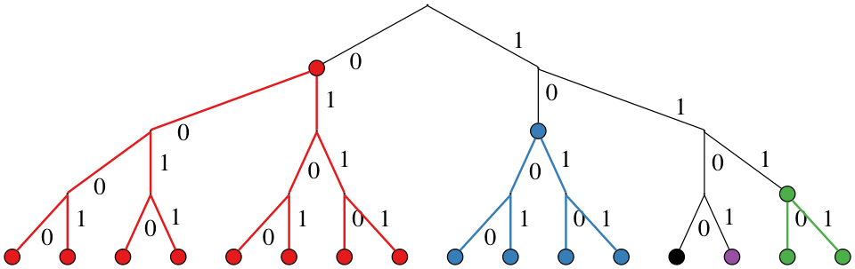
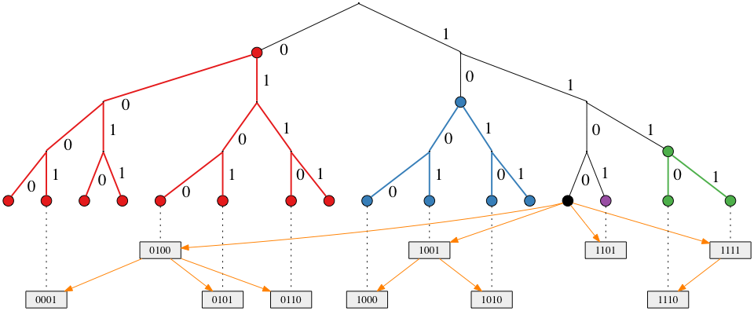

Network Protocol
----------------

Based on *Kademlia* (Maymounkov and Mazieres 2002) and its extension *S/Kademlia* (Baumgart and Mies 2007). Each node is identified by a `nodeId` which is computed using a crypto puzzle. The puzzle generates also a key pair that is used to sign and verify integrity of messages.

Kademlia builds a *structured overlay* network, so nodes connections are not built at random, but following the protocol's rules. Data (in a file-sharing application for example) and routing information are held in a *distributed hash table* (DHT). The word distributed means that global information are not held anywhere and any peer maintains a small portion of it; more specifically only the portion it is responsible for, again following the protocol's rules.

Kademlia uses four RPCs for node / value lookup, routing table maintenance and storing values in the DHT:

-   `ping`: usual ping / pong request to check liveness of nodes;
-   `store`: instructs the target node to store a `(key, value)` pair;
-   `find_node`: takes a `nodeId` as an argument and the recipient of the request returns a list of *k* triples `(IPaddr, UDPport, nodeId)` of nodes closest to the queried `nodeId`;
-   `find_value`: behaves like `find_node` with the exception that if the target node has previously received a `store` request for the target key, it will return the stored value directly.

At the moment Concord implements only `ping` and `find_node` RPCs. This is because the other ones seem related to a file-sharing application. The future development of the voting protocol will tell us if and in what extent Concord will need to implement `store` and `find_value` procedures.

Nodes are stored in a DHT. The local DHT is organized in *k-buckets*. For each bit in the `nodeId`, a node maintains a k-bucket, that is a FIFO list of nodes sorted with a last-seen policy (least recently seen node at the head). Let be *n* the number of bits in the `nodeId`. Each node maintains *n* k-buckets and each of them contains nodes at distance between 2<sup>*i*</sup> and 2<sup>*i* + 1</sup> ∀*i* ∈ {0, ..., *n* − 1}.



In the above Figure, we show Kademlia's DHT for nodeId `1100` in a network where the ID space is in 4 bits. Each color corresponds to a different k-bucket's range. In each k-bucket node IDs can be present or not (in the Figure, all nodes are shown as present) and each node maintains locally a list of *k* nodes for each bucket. Note also that each k-bucket is responsible for progressively twice the number of node IDs when moving away from the local node's ID, that is *n*<sub>*i*</sub> = 2*n*<sub>*i* − 1</sub>∀*i* ∈ {1, ..., *n* − 1} and *n*<sub>0</sub> = 1 where *n*<sub>*i*</sub> is the number of possible node IDs in bucket *i*. By moving away from the current node ID, each k-bucket covers twice the number of node IDs.

### Broadcasting

This term is used to mean a *one to all* communication originating at a single node. Broadcasting is for example used in BitTorrent to announce to other peers when a node starts downloading a file, in Concord it is used to announce a new poll. The problem of efficient broadcasting (that is, with a minimum number of messages) has been tackled in (El-Ansary et al. 2003). The paper focuses on Chord's DHT and overlay structure, but gives great hindsights on the subject. (Zoltdn Czirkos and Hosszu 2010) and (Zoltán Czirkos and Hosszú 2013) expand on the same idea, with a focus instead on Kademlia. The broadcasting algorithm exploits the network structure so to optimize the number of messages exchanged. The basic idea is an application of the divide-et-impera strategy: each node at each round is responsible for a smaller subtree than nodes at the previous round.



The Figure above shows an example execution of the broadcast algorithm with node `1100` as the initiator. It starts the procedure by sending the message to a randomly selected node for each k-bucket. Each of the contacted node is then responsible for the subtree referenced by the k-bucket it belongs to. Each message contains also the height of the tree the receiving node is responsible for. Recursively then each of those nodes forwards the message to a randomly selected node in each of its k-buckets among those that reference nodes at the height it is responsible for (contained in the message originally received). When forwarding the message, each node increases the height field in the message, in order to limit the responsibility of the receiving node, based on its distance from the sender.

**Broadcast Algorithm 1** <br /> *Input: message text, height*

``` ruby
(0..height-1).each do |i|
  if (buckets[i].size != 0) then
    node = random node from buckets[i]
    send(node, message, i)
  end
end
```

The algorithm above implements the broadcast. An initiator node sets the height to *n* − 1, the number of k-buckets, and the message text at will. Then starts sending the message to a randomly picked node from each k-bucket *i*. The buckets are sorted in a way that `buckets[0]` can contain maximum one node and is the closest possible from itself (their node IDs differs by only one least significant bit), that is k-bucket indexed with *i* contains nodes at a distance between 2<sup>*i*</sup> and 2<sup>*i* + 1</sup>. When sending a message to a node in the *i*-th bucket, the sender sets the height in the message to *i*, so to limit the broadcasting scope of the receiver. The height in this sense, represent the tree height-level already covered by other nodes.

The problem with this algorithm is that some nodes are responsible of large subtrees. If one of these nodes fails to deliver the message, big subtrees wont receive it. Consider the first round of broadcasting, so messages are sent by the initiator to a node in each bucket. The node picked from the farthest bucket will be the only responsible of forwarding the message to other nodes in its subtree, which covers addressed at a distance between 2<sup>*n* − 1</sup> and 2<sup>*n*</sup>, that is half the global tree. If that node fails to deliver the message (because of any of the possible failure types, i.e. crash, Byzantine), then, supposing a perfect binary tree, half of the nodes in the network wont receive the message.

In (Zoltán Czirkos and Hosszú 2013) the *reliability* of the broadcasting algorithm is defined as the ratio between nodes that receive the message and the total number of nodes in the network: $m = \\frac{N\_r}{N}$ where *N* is the total number of nodes and *N*<sub>*r*</sub> is the number of nodes that receive the message. The authors set a probabilistic framework to evaluate the reliability starting from a measure of *successful delegate selection*, that is a message is successfully broadcasted in a subtree through the selection of a delegate like Algorithm 1. They define a delegate selection to be successful if the packet does not encounter any of three cases I) it is lost, II) the receiver is Byzantine or III) the entry in the routing table for the receiver is stale. The successful delegation probability is *P* = 1 − *P*<sub>*h*</sub> where *P*<sub>*h*</sub> denotes the probability of failure. The authors show that for a balanced tree of height *b*, the reliability of Algorithm 1 is given by $m = \\left( \\frac{1 + P}{2} \\right)^b$.

To improve the reliability of the broadcasting algorithm, the authors of the same paper proposed an upgraded version of Algorithm 1 that uses *replication*. In Algorithm 2 the message is sent to more nodes in the same k-bucket, in this way there is not any more a single point of failure in a subtree, but the responsibility is replicated among a number *k*<sub>*b*</sub> of them. To maintain efficiency it is required that *k*<sub>*b*</sub> ≤ *k* in order to avoid sending `find_node` requests. Moreover because a node can now receive a message more than once, each message has to be tagged with a unique identifier.

**Broadcast Algorithm 2** <br /> *Input: identifier, message text, height*

``` ruby
return if seen_messages.includes? identifier
seen_messages = seen_messages + [identifier]
(0..height-1).each do |i|
  if buckets[i].size != 0 then
    nodes = Kb random nodes from buckets[i]
    nodes.each do |node|
      send(node, identifier, message, i)
    end
  end
end
```

By selecting more nodes from each k-bucket, the probability of failing to broadcast the message in a subtree will be *P*<sub>*h*</sub><sup>*k*<sub>*b*</sub></sup> where *P*<sub>*h*</sub> is the probability of a single message getting lost and of the broadcast failing in the subtree the receiving node was responsible for. For example in a network with a fairly high amount of packets loss, lets say *P*<sub>*h*</sub> = 10%, selecting a replication factor of *k*<sub>*b*</sub> = 2 will reduce the probability of losing a message to *P*<sub>*h*</sub><sup>2</sup> = 1%, thus the probability of successful delegation is increased from *P* = 90% to *P* = 99%. By substituting *P*<sub>*h*</sub><sup>*k*<sub>*b*</sub></sup> into *P*<sub>*h*</sub> in the reliability's formula and solve for *k*<sub>*b*</sub>, we obtain an expression of the replication factor as a function of the reliability *m*, the tree height *b* and the probability of packet loss *P*<sub>*h*</sub>:
$$k\_b = \\left\\lceil \\frac{\\ln (2 (1 - \\sqrt\[b\]{m}))}{\\ln P\_h} \\right\\rceil$$

Voting Protocol
---------------

The goal of this protocol is to allow anyone to create a poll and collect opinions on it. Each node is itself a voter and everyone is free to participate in the voting process. Each voter is also responsible of verification of votes and votes counting.

### Starting a Poll

Whenever someone wants to start a poll, he / she has to send a `start_poll` RPC. This procedure contains the poll's question and its hash, computed from the text and a nonce. This hash is then used to build the **poll's Merkle tree** (details to come in a later section). Each node that wants to take part in the poll, has to find a key pair for which the hash of the public key is numerically less then the `start_poll` *genesis* hash (the created with the aforementioned RPC). The process is similar to the `nodeId` generation in S/Kademlia and is used to prevent huge amounts of valid key pairs for a single poll. The `start_poll` message contains also a TTL (time-to-live) indicating the maximum time allowed to find a valid key pair for the poll. TTL and crypto puzzle difficulty are measures that control the ability of nodes to generate an high number of valid key pairs.


The node that starts the poll is responsible of sending the `start_poll` RPC to other nodes. To do so it has to send the RPC to all nodes that it knows about and sends the same request to other nodes that discovers through recursively call `find_node` on new nodes that discovers. Another strategy / extension could be to start searching for nodes randomly by generating a random `nodeId` starting a recursive lookup for that node and sending `start_poll` requests along the way. Nodes that decide to participate in the poll sends an `ack_poll` back to the node from which came to know about the poll. This RPC does not contain nodes and means that the node is taking responsibility to forward the `start_poll` message to its neighbors (all nodes that it knows about or only *k* closest neighbors are options). Nodes that do not want to participate in the poll send an `nack_poll` RPC containing its *k* closest nodes.

After the TTL expires, each node participating in the poll has a key pair that can be used to vote the poll.

 References
-----------

Baumgart, Ingmar, and Sebastian Mies. 2007. “S/Kademlia: A Practicable Approach Towards Secure Key-Based Routing.” In *Parallel and Distributed Systems, 2007 International Conference on*, 2:1–8. IEEE.

Czirkos, Zoltán, and Gábor Hosszú. 2013. “Solution for the Broadcasting in the Kademlia Peer-to-Peer Overlay.” *Computer Networks* 57 (8). Elsevier: 1853–62.

Czirkos, Zoltdn, and Gdbor Hosszu. 2010. “Enhancing the Kademlia P 2 P Network.” *Periodica Polytechnica, Electrical Engineering* 54 (3-4). Budapest University of Technology and Economics: 87–92.

El-Ansary, Sameh, Luc Onana Alima, Per Brand, and Seif Haridi. 2003. “Efficient Broadcast in Structured P2p Networks.” In *International Workshop on Peer-to-Peer Systems*, 304–14. Springer.

Maymounkov, Petar, and David Mazieres. 2002. “Kademlia: A Peer-to-Peer Information System Based on the Xor Metric.” In *International Workshop on Peer-to-Peer Systems*, 53–65. Springer.
