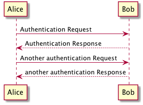

Network Protocol
----------------

Based on *Kademlia* (Maymounkov and Mazieres 2002) and its extension *S/Kademlia* (Baumgart and Mies 2007). Each node is identified by a `nodeId` which is computed using a crypto puzzle. The puzzle generates also a key pair that is used to sign and verify integrity of messages.

Kademlia uses four RPCs for node / value lookup, routing table maintenance and storing values in the DHT:

-   `PING`: usual ping / pong request to check liveness of nodes;
-   `STORE`: instructs the target node to store a `(key, value)` pair;
-   `FIND_NODE`: takes a `nodeId` as an argument and the recipient of the request returns a list of *k* triples `(IPaddr, port, nodeId)` of nodes closest to the queried `nodeId`;
-   `FIND_VALUE`: behaves like `FIND_NODE` with the exception that if the target node has previously received a `STORE` request for the target key, it will return the stored value directly.

At the moment Concord implements only `PING` and `FIND_NODE` RPCs. This is because the other ones seem related to a file-sharing application. The future development of the voting protocol will tell us if and in what extent Concord will need to implement `STORE` and `FIND_VALUE` procedures.

Voting Protocol
---------------

The goal of this protocol is to allow anyone to create a poll and collect opinions on it. Each node is itself a voter and everyone is free to participate in the voting process. Each voter is also responsible of verification of votes and votes counting.

 References
-----------

Baumgart, Ingmar, and Sebastian Mies. 2007. “S/Kademlia: A Practicable Approach Towards Secure Key-Based Routing.” In *Parallel and Distributed Systems, 2007 International Conference on*, 2:1–8. IEEE.

Maymounkov, Petar, and David Mazieres. 2002. “Kademlia: A Peer-to-Peer Information System Based on the Xor Metric.” In *International Workshop on Peer-to-Peer Systems*, 53–65. Springer.
